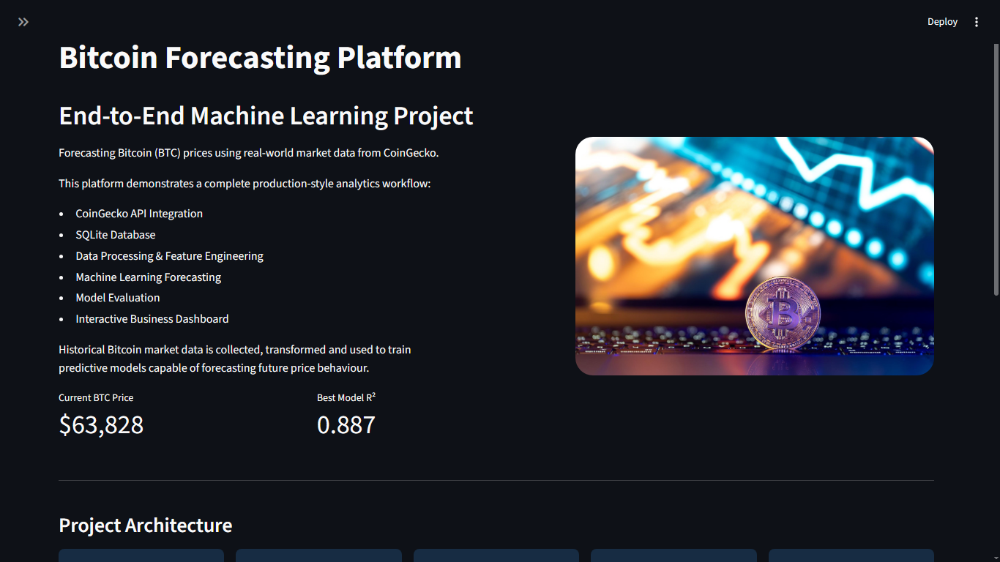
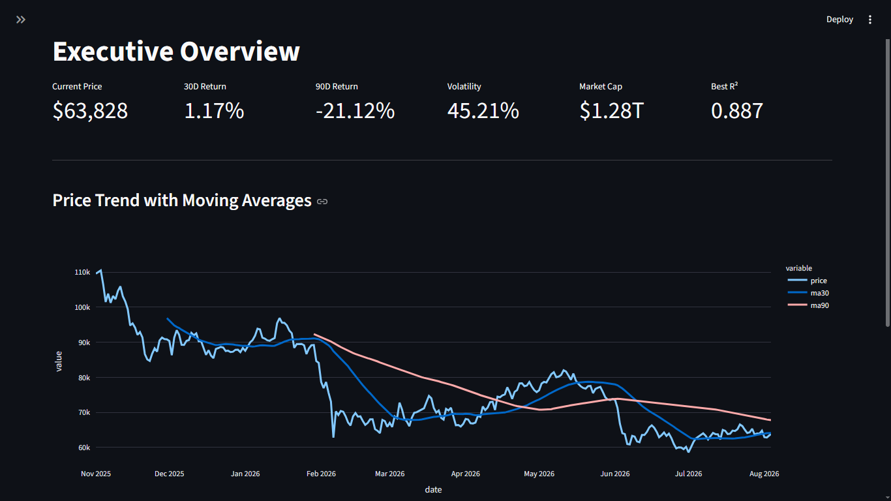
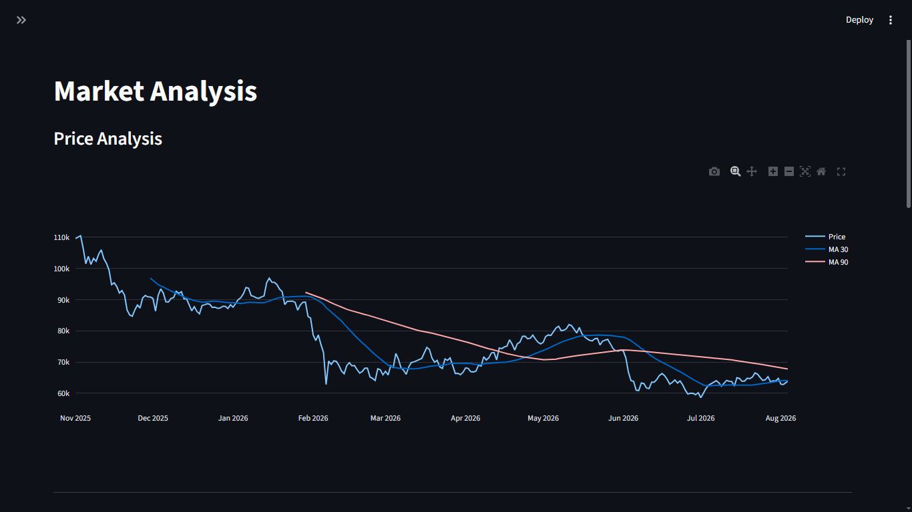
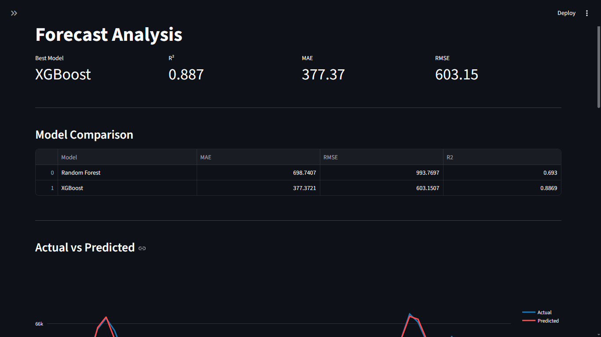

# Bitcoin Forecasting Platform

End-to-End Machine Learning project focused on forecasting Bitcoin (BTC) prices using real-world cryptocurrency market data from CoinGecko.


---

## Overview

This project demonstrates a complete data workflow, from external API ingestion to machine learning forecasting and interactive visualization.

The platform collects historical Bitcoin market data from CoinGecko, stores it in a relational database, performs feature engineering, trains predictive models, evaluates performance, and presents results through a professional Streamlit dashboard.

---

## Business Problem

Cryptocurrency markets are highly volatile and generate massive amounts of data every day.

The objective of this project is to build a forecasting pipeline capable of learning historical Bitcoin market behavior and predicting future price movements using machine learning techniques.

---

## Architecture

```text
CoinGecko API
        │
        ▼
Data Collection
        │
        ▼
SQLite Database
        │
        ▼
Data Processing
        │
        ▼
Feature Engineering
        │
        ▼
Machine Learning
        │
        ▼
Forecast Generation
        │
        ▼
Interactive Dashboard
```

---

## Technology Stack

| Category | Technology |
|-----------|-----------|
| API | CoinGecko |
| Database | SQLite |
| Data Processing | Pandas |
| Visualization | Plotly |
| Machine Learning | Scikit-Learn |
| Gradient Boosting | XGBoost |
| Dashboard | Streamlit |

---

## Project Structure

```text
crypto-forecasting-platform/
│
├── data/
│   ├── raw/
│   ├── processed/
│   └── predictions/
│
├── imagens/
│   └── crypto-forecasting-platform.jpg
│
├── models/
│
├── src/
│   ├── api/
│   ├── database/
│   ├── features/
│   ├── models/
│   └── dashboard/
│
├── main.py
├── requirements.txt
└── README.md
```

---

## Dataset

Source:

CoinGecko Market Chart API

Collected metrics:

- Bitcoin Price
- Market Capitalization
- Trading Volume

Historical coverage:

- 365 daily observations

---

## Machine Learning Models

The project compares multiple forecasting approaches.

### Random Forest

Ensemble-based model using decision trees.

### XGBoost

Gradient boosting algorithm optimized for predictive performance.

---

## Model Performance

| Model | MAE | RMSE | R² |
|---------|---------:|---------:|---------:|
| Random Forest | 697.30 | 993.07 | 0.693 |
| XGBoost | 378.53 | 603.24 | 0.887 |

### Best Model

**XGBoost**

Performance achieved:

- R² = 0.887
- MAE = 378.53
- RMSE = 603.24

---

## Dashboard Pages

### Landing Page




Project overview, architecture, performance summary and technology stack.

### Executive Overview



High-level Bitcoin market KPIs and trend analysis.

### Market Analysis



Historical price behavior, volatility analysis, volume relationships and market statistics.

### Forecast Analysis



Model comparison, prediction performance and forecast error analysis.

---

## Features

- Real-world API integration
- Automated data ingestion
- SQLite data storage
- Feature engineering pipeline
- Machine learning forecasting
- Model comparison framework
- Interactive dashboard
- Forecast error analysis
- Downloadable predictions

---

## Installation

Clone the repository:

```bash
git clone https://github.com/YOUR_USERNAME/crypto-forecasting-platform.git
```

Enter the project directory:

```bash
cd crypto-forecasting-platform
```

Install dependencies:

```bash
pip install -r requirements.txt
```

---

## Running the Pipeline

Execute:

```bash
python main.py
```

This will:

1. Create the database
2. Download Bitcoin market data
3. Build the modeling dataset
4. Train machine learning models
5. Generate predictions
6. Save the best model

---

## Running the Dashboard

```bash
streamlit run src/dashboard/app.py
```

---

## Key Skills Demonstrated

- API Integration
- Data Engineering
- Feature Engineering
- Machine Learning
- Model Evaluation
- Forecasting
- Dashboard Development
- Business Intelligence
- Python Development

---

## Future Improvements

- Multi-asset forecasting
- Ethereum and Altcoin support
- Automated retraining pipeline
- Cloud deployment
- Real-time predictions
- MLOps integration

---

## Author

Rodrigo C. Furlan

LinkedIn:
[https://www.linkedin.com/in/rodrigocfurlan/]
